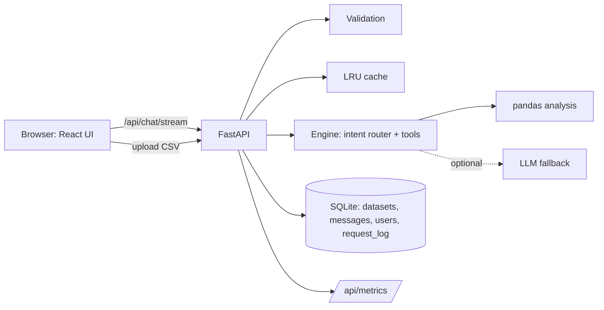

# DataSetu – AI Data Analyst

Upload CSV files and ask questions in plain language. Every answer comes with a chart, SQL, pandas code and the reasoning.

```
frontend/   React + Vite UI (src/*.jsx). Light theme by default, dark toggle, government-portal styling.
backend/    FastAPI: upload/validation, chat (+streaming), analysis engine, auth, dashboard, search, metrics, evals, tests.
database/   schema.sql, SQLite app.db (created on first run), samples/ (sales_sample.csv, customers_sample.csv)
```

## 🎬 Demo Video

<div align="center">

<a href="https://drive.google.com/file/d/1s9QNsVT_GCTQUYOkMA7c-8Q40N42Bz3r/view?usp=drivesdk">


</a>

<br><br>

### ▶️ Click the preview to watch the full demo

**DataSetu AI — Intelligent Data Analysis & Decision Support Platform**

</div>

## Run
**Docker:** `docker compose up --build` → http://localhost:8000
**Dev:** `pip install -r backend/requirements.txt && uvicorn main:app --app-dir backend --port 8000`, then `cd frontend && npm install && npm run dev` → http://localhost:5173
**Single server:** `cd frontend && npm install && npm run build`, then start uvicorn as above.
**Tests:** `cd backend && pytest`   **Evaluation:** `python backend/evals/run_eval.py`
Optional: `ANTHROPIC_API_KEY` lets an LLM answer questions the built-in engine does not recognise (`LLM_MODEL` to change model).

## Architecture


## Requirement coverage
| Core requirement | Implementation |
|---|---|
| Upload and validate multiple CSVs | `POST /api/upload`: type, size, empty, duplicate columns, encoding, delimiter detection; per-file errors |
| Natural-language answers | `engine.analyze` intent router (ranking, trend, share, correlation, summary…) |
| Business insights and summaries | summary intent + the tool-calling agent ("Give me an executive summary") |
| Charts (bar, line, pie, scatter) | engine returns a chart spec, React renders it with Chart.js |
| SQL and pandas code | returned with each analysis; "Generate SQL for this analysis" reuses the last one |
| Anomalies with reasons | IQR rule (3×IQR), table with value, expected range and direction |
| Reasoning | "Why this answer" on every reply |
| Conversation context | server-side session: history, last SQL/pandas, selected dataset |

| Bonus | Where |
|---|---|
| Multi-file analysis | `features.find_join`: questions that use columns from another file auto-join on the shared key |
| Dashboard generation | `GET /api/dashboard/{name}` → KPI cards + charts; page `#dashboard` |
| Data quality checks | quality intent: missing cells, duplicates, health score |
| Forecasting | linear-trend forecast, 3 months, dashed line on chart |
| Agentic workflow / tool calling | `engine.agent`: plans tools (quality → anomalies → ranking → trend), runs them, composes summary + actions; steps shown in reasoning |
| Semantic search | `GET /api/search`: TF-IDF over dataset names, columns, column values and past questions (lexical, no embeddings) |
| Caching | LRU keyed by data fingerprint + question; shown as "served from cache" |
| Authentication | register / login / guest, PBKDF2 hashes, bearer tokens, `/api/history` |
| Export reports | HTML (print to PDF) and Markdown, include the SQL |
| Streaming responses | `POST /api/chat/stream` (NDJSON): progress steps, then the answer incrementally; Stop button |
| Observability / logging | request id + latency log, `request_log` table, `GET /api/metrics` (requests, errors, avg/p95, cache) |
| Evaluation framework | `backend/evals/run_eval.py`: 10 cases with ground truth computed independently in pandas |

## Assumptions and limits
- Without an API key the engine is rule-based; unclear questions (e.g. "abc") get the column list and suggested questions.
- Streaming shows real progress steps; the answer text is streamed after it is computed (not token-by-token from an LLM).
- Datasets are shared by all users of one deployment; login attributes history to a user.
- Chart.js loads from a CDN, so charts need internet access.
- Add the architecture screenshot, UI screenshots and a demo link/video here before submitting.
